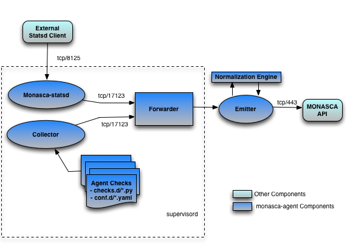

<!-- START doctoc generated TOC please keep comment here to allow auto update -->
<!-- DON'T EDIT THIS SECTION, INSTEAD RE-RUN doctoc TO UPDATE -->
**Table of Contents**  *generated with [DocToc](http://doctoc.herokuapp.com/)*

- [Introduction](#introduction)
- [Architecture](#architecture)
- [Installing](#installing)
- [Configuring](#configuring)
  - [monasca-setup (Recommended)](#monasca-setup-recommended)
    - [Explanation of monasca-setup command-line parameters:](#explanation-of-monasca-setup-command-line-parameters)
    - [Manual Configuration of the Agent](#manual-configuration-of-the-agent)
    - [Manual Configuration of Plugins](#manual-configuration-of-plugins)
  - [Chef Cookbook](#chef-cookbook)
  - [monasca-alarm-manager](#monasca-alarm-manager)
- [Running](#running)
  - [Running from the command-line](#running-from-the-command-line)
  - [Running as a daemon](#running-as-a-daemon)
- [Troubleshooting](#troubleshooting)
- [Naming conventions](#naming-conventions)
  - [Common Naming Conventions](#common-naming-conventions)
    - [Metric Names](#metric-names)
    - [System Dimensions](#system-dimensions)
  - [OpenStack Specific Naming Conventions](#openstack-specific-naming-conventions)
    - [Metric Names](#metric-names-1)
    - [OpenStack Dimensions](#openstack-dimensions)
- [System Checks](#system-checks)
  - [System Metrics](#system-metrics)
- [Plugin Checks](#plugin-checks)
  - [Developing New Checks](#developing-new-checks)
    - [AgentCheck Interface](#agentcheck-interface)
    - [ServicesCheck interface](#servicescheck-interface)
    - [Sending Metrics](#sending-metrics)
    - [Plugin Configuration](#plugin-configuration)
      - [init_config](#init_config)
      - [instances](#instances)
      - [Plugin Documentation](#plugin-documentation)
  - [Nagios Checks](#nagios-checks)
  - [Host Alive Checks](#host-alive-checks)
  - [Process Checks](#process-checks)
  - [Http Endpoint Checks](#http-endpoint-checks)
  - [MySQL Checks](#mysql-checks)
  - [ZooKeeper Checks](#zookeeper-checks)
  - [Kafka Checks](#kafka-checks)
  - [RabbitMQ Checks](#rabbitmq-checks)
  - [Apache Web Server Checks](#apache-web-server-checks)
  - [OpenStack Monitoring](#openstack-monitoring)
    - [Nova Checks](#nova-checks)
        - [Nova Processes Monitored](#nova-processes-monitored)
        - [Example Nova Metrics](#example-nova-metrics)
    - [Swift Checks](#swift-checks)
        - [Swift Processes Monitored](#swift-processes-monitored)
        - [Example Swift Metrics](#example-swift-metrics)
    - [Glance Checks](#glance-checks)
        - [Glance Processes Monitored](#glance-processes-monitored)
        - [Example Glance Metrics](#example-glance-metrics)
    - [Cinder Checks](#cinder-checks)
        - [Cinder Processes Monitored](#cinder-processes-monitored)
        - [Example Cinder Metrics](#example-cinder-metrics)
    - [Neutron Checks](#neutron-checks)
        - [Neutron Processes Monitored](#neutron-processes-monitored)
        - [Example Neutron Metrics](#example-neutron-metrics)
    - [Keystone Checks](#keystone-checks)
        - [Keystone Processes Monitored](#keystone-processes-monitored)
        - [Example Keystone Metrics](#example-keystone-metrics)
    - [Ceilometer Checks](#ceilometer-checks)
        - [Ceilometer Processes Monitored](#ceilometer-processes-monitored)
        - [Example Ceilometer Metrics](#example-ceilometer-metrics)
  - [Libvirt VM Monitoring](#libvirt-vm-monitoring)
    - [Overview](#overview)
    - [Configuration](#configuration)
    - [Instance Cache](#instance-cache)
    - [Metrics Cache](#metrics-cache)
    - [Metrics](#metrics)
    - [Dimensions](#dimensions)
    - [Cross-Tenant Metric Submission](#cross-tenant-metric-submission)
- [Statsd](#statsd)
- [License](#license)

<!-- END doctoc generated TOC please keep comment here to allow auto update -->


# Introduction
The Monasca Agent is a modern Python monitoring agent for gathering metrics and sending them to the Monasca API. The Agent supports collecting metrics from a variety of sources as follows:

* System metrics such as cpu and memory utilization.
* Nagios plugins. The Monasca Agent can run Nagios plugins and send the status code returned by the plugin as a metric to the Monasca API.
* Statsd. The Monasca Agent supports an integrated Statsd daemon which can be used by applications via a statsd client library.
* Host alive. The Monasca Agent can perform active checks on a host to determine if it is alive using ping(ICMP) or SSH.
* Process checks. The Monasca Agent can check a process and return several metrics on the process such as number of instances, memory, io and threads.
* Http Endpoint checks. The Monasca Agent can perform active checks on http endpoints by sending an HTTP request to an API.
* Service checks. The Agent can check service such as MySQL, RabbitMQ, and many more.
* OpenStack metrics.  The agent can perform checks on OpenStack processes.
* The Agent can automatically detect and setup checks on certain processes and resources.

For the complete list of metrics that the Monasca Agent supports see "Checks" below.

The Agent is extensible through configuration of additional plugins, written in Python.

# Architecture
This section describes the overall architecture of the Monasca Agent.  The agent consists of the supervisor, collector, forwarder and statsd daemon.

This diagram illustrates the monasca-agent architecture, and the table which follows it explains each component.



The flow of the agent application goes like this:

* The collector runs based on a configurable interval and collects the base system metrics such as cpu or disk utilization as well as any metrics from additional configured plugins such as mySQL or Kafka.
* The statsd daemon allows users to send statsd type messages to the agent at any time.  These messages are flushed periodically to the forwarder.
* The forwarder, is a Tornado web server application that takes the metrics from the collector and statsd daemon, normalizes the metric names and forwards them on to the Monasca-API.
* Once sent to the Monasca-API, the metrics continue through the Monasca pipeline and end up in the Metrics Database.
* The collector then waits for the configured interval and restarts the collection process.

The Agent is composed of the following components:

* Supervisor (supervisord): Manages the lifecycle of the Collector, Forwarder and Statsd Daemon.
* Collector (monasca-collector): Collects system and other metrics and sends to the Forwarder.
* Forwarder (monasca-forwarder): Sends metrics to the API.
* Statsd Daemon (monasca-statsd): Statsd daemon.
* Monasca Setup (monasca-setup)

| Component Name | Process Name | Description |
| -------------- | ------------ | ----------- |
| Supervisor | supervisord | Runs as root, launches all other processes as the "monasca-agent" user.  This process manages the lifecycle of the Collector, Forwarder and Statsd Daemon.  It allows Start, Stop and Restart of all the agent processes together. |
| Collector | monasca-collector | Gathers system & application metrics on a configurable interval and sends them to the Forwarder process. | 
| Forwarder | monasca-forwarder | Gathers data from the collector and statsd and submits it to Monasca API over SSL (tcp/17123) | 
| Statsd Daemon | monasca-statsd | Statsd engine capable of handling dimensions associated with metrics submitted by a client that supports them. Also supports metrics from the standard statsd client. (udp/8125) | 
| Monasca Setup | monasca-setup | The monasca-setup script collects command-line arguments and configures the and starts the agent.  the Monasca Setup program can also auto-detect and configure certain agent plugins | 
| Agent Checks | checks.d/*.py | Python-based user-configured checks.  These checks can be for other applications or services to verify functionality or gather statistics on things such as messages processed, etc.  Each additional agent check must be configured using a yaml file for a specific plugin that provides the additional functionality located in the conf.d directory. |


The Agent includes the "monasca-setup" script, that can be used for automatically configuring the agent to generate metrics that are sent to the API.  It creates the agent.yaml file located in /etc/monasca/agent directory.  It also sets up additional checks based on what is running locally on that machine.  For instance, if this is a compute node, the agent will setup checks to monitor the Nova processes and setup a http_status check on the nova-api.  It can also detect other servers such as mySQL and Kafka and setup checks for them as well.

A metric is identified by a name and dimensions.  The fields required in a metric are name, timestamp, and value.  A metric can also have 0..n dimensions.  Some standard dimensions are sent with all metrics that are sent by the agent.  Reference the section on [Dimensions](#dimensions) for more details.

The [monasca-alarm-manager](**https://github.com/hpcloud-mon/monasca-alarm-manager**) is a utility that is under development that can be used for configuring a default set of alarms when monitoring a OpenStack deployment.

# Installing
The Agent (monasca-agent) is available for installation from the Python Package Index (PyPI). To install it, you first need `pip` installed on the node to be monitored. Instructions on installing pip may be found at https://pip.pypa.io/en/latest/installing.html.  The Agent will NOT run under any flavor of Windows or Mac OS at this time but has been tested thoroughly on Ubuntu and should work under most flavors of Linux.  Support may be added for Mac OS and Windows in the future.  Example of an Ubuntu or Debian based install:

```
sudo apt-get install python-pip
```

To ensure you are running the latest version of pip

```
sudo pip install --upgrade pip
```

Warning, the Agent is known to not install properly under python-pip version 1.0, which is packaged with Ubuntu 12.04 LTS (Precise Pangolin).

The Agent can be installed using pip as follows:

```
sudo pip install monasca-agent
```

# Configuring
The Agent requires configuration in order to run. There are two ways to configure the agent, either using the [monasca-setup](#monasca-setup) script or manually.

## monasca-setup (Recommended)
The Monasca agent has a script, called "monasca-setup", that should be used to automatically configure the Agent to send metrics to a Monasca API. This script will create the agent.yaml configuration file as well as any plugin configuration yaml files needed to monitor the processes on the local machine.  The mon-setup script will auto-detect certain applications and OpenStack processes that are running on the machine.  The agent configuration files are located in /etc/monasca/agent.  The plugin configuration files are located in /etc/monasca/agent/conf.d.

To run monasca-setup:

```
sudo monasca-setup --username KEYSTONE_USERNAME --password KEYSTONE_PASSWORD --project_name KEYSTONE_PROJECT_NAME --service SERVICE_NAME --keystone_url http://URL_OF_KEYSTONE_API:35357/v3 --monasca_url http://URL_OF_MONASCA_API:8080/v2.0 --overwrite
```
### Explanation of monasca-setup command-line parameters:
All parameters require a '--' before the parameter such as '--verbose'

| Parameter | Description | Example Value|
| ----------- | ------------ | ----------- |
| username | This is a required parameter that specifies the username needed to login to Keystone to get a token | myuser |
| password | This is a required parameter that specifies the password needed to login to Keystone to get a token | mypassword |
| project_name | This is a required parameter that specifies the name of the Keystone project name to store the metrics under | myproject |
| keystone_url | This is a required parameter that specifies the url of the keystone api for retrieving tokens | http://192.168.1.5:35357/v3 |
| service | This is an optional parameter that specifies the name of the service associated with this particular node | nova, cinder, myservice |
| monasca_url | This is a required parameter that specifies the url of the monasca api for retrieving tokens | http://192.168.1.4:8080/v2.0 |
| config_dir | This is an optional parameter that specifies the directory where the agent configuration files will be stored. | /etc/monasca/agent |
| log_dir | This is an optional parameter that specifies the directory where the agent log files will be stored. | /var/log/monasca/agent |
| template_dir | This is an optional parameter that specifies the directory where the agent template files will be stored. | /usr/local/share/monasca/agent |
| user | This is an optional parameter that specifies the user name to run monasca-agent as | monasca-agent |
| headless | This is an optional parameter that specifies whether monasca-setup should run in a non-interactive mode | |
| skip_enable | This is an optional parameter. By default the service is enabled, which requires the script run as root. Set this parameter to skip that step. | |
| verbose | This is an optional parameter that specifies whether the monasca-setup script will print additional information for debugging purposes | |
| system_only | This optional parameter if set true will cause only the basic system checks to be configured all other detection will be skipped. Basic system checks include cpu, disk, load, memory, network. ||
| overwrite | This is an optional parameter to overwrite the plugin configuration.  Use this if you don't want to keep the original configuration.  If this parameter is not specified, the configuration will be appended to the existing configuration, possibly creating duplicate checks.  **NOTE:** The agent config file, agent.yaml, will always be overwritten, even if this parameter is not specified |  |
| amplifier | For load testing purposes, this value will multiply the number of metrics submitted in each payload.  Set to 1 for one additional set of metrics, 2 for two additional sets, etc.  Additional sets of metrics are identified by the 'amplifier' dimension.  Set to 0 for typical production use. | 0 |

### Manual Configuration of the Agent

This is not the recommended way to configure the agent but if you are having trouble running the monasca-setup program, you can manually configure the agent using the steps below:

Start by creating an agent.yaml file.  An example configuration file can be found in /usr/local/share/monasca/agent/.

    sudo mkdir -p /etc/monasca/agent
    sudo cp /usr/local/share/monasca/agent/agent.yaml.template /etc/monasca/agent/agent.yaml

and then edit the file with your favorite text editor (vi, nano, emacs, etc.)

    sudo nano /etc/monasca/agent/agent.yaml

In particular, replace any values that have curly braces.
Example:
Change

	username: {args.username}

			to

	username: myuser

You must replace all of the curly brace values and you can also optionally tweak any of the other configuration items as well like a port number in the case of a port conflict.  The config file options are documented in the agent.yaml.template file.  You may also specify zero or more dimensions that would be included in every metric generated on that node, using the dimensions: value. Example: (include no extra dimensions on every metric)

    dimensions: (No dimensions example)
			OR
    dimensions: (Single dimension example)
        service: nova
    		OR
    dimensions: (3 dimensions example)
        service: nova
        group: group_a
        zone: 2

Once the configuration file has been updated and saved, monasca-agent must be restarted.

    sudo service monasca-agent restart


### Manual Configuration of Plugins
If you did not run monasca-setup and/or there are additional plugins you would like to activate, follow the steps below:

Agent plugins are activated by placing a valid configuration file in the /etc/monasca/agent/conf.d/ directory. Configuration files are in YAML format, with the file extension .yaml. You may find example configuration files in /usr/local/share/monasca/agent/conf.d/

For example, to activate the http_check plugin:

    sudo mkdir -p /etc/monasca/agent/conf.d
    sudo cp /usr/local/share/monasca/agent/conf.d/http_check.yaml.example /etc/monasca/agent/conf.d/http_check.yaml

and then edit the file as needed for your configuration.

    sudo nano /etc/monasca/agent/conf.d/http_check.yaml

The plugins are annotated and include the possible configuration parameters. In general, though, configuration files are split into two sections:
init_config
   and
instances
The init_config section contains global configuration parameters for the plugin. The instances section contains one or more check to run. For example, multiple API servers can be checked from one http_check.yaml configuration by listing YAML-compatible stanzas in the instances section.

A plugin config is specified something like this:

    init_config:
    	is_jmx: true

    	# Metrics collected by this check. You should not have to modify this.
    	conf:
       	#
       	# Aggregate cluster stats
        	#
        	- include:
            domain: '"kafka.server"'
            bean: '"kafka.server":type="BrokerTopicMetrics",name="AllTopicsBytesOutPerSec"'
            attribute:
                MeanRate:
                    metric_type: counter
                    alias: kafka.net.bytes_out

    instances:
		- 	host: localhost
        	port: 9999
        	name: jmx_instance
        	user: username
        	password: password
        	#java_bin_path: /path/to/java #Optional, should be set if the agent cannot find your java executable
        	#trust_store_path: /path/to/trustStore.jks # Optional, should be set if ssl is enabled
        	#trust_store_password: password
        	dimensions:
             env: stage
             newDim: test


## Chef Cookbook
An example cookbook for Chef configuration of the monitoring agent is at [https://github.com/stackforge/cookbook-monasca-agent](https://github.com/stackforge/cookbook-monasca-agent).  This cookbook can be used as an example of how to automate the install and configuration of the monasca-agent.

## monasca-alarm-manager
To help configure a default set of alarms for monitoring an OpenStack deployment the `monasca-alarm-manager` can be used. The alarm manager is under development in Github at, [https://github.com/hpcloud-mon/monasca-alarm-manager](https://github.com/hpcloud-mon/monasca-alarm-manager).

# Running
The Agent can be run from the command-line or as a daemon.

## Running from the command-line
TBD

## Running as a daemon
To control the monasca-agent daemon, you can use the init.d commands that are listed below:

	* To start the agent daemon:
		sudo service monasca-agent start
	* To stop the agent daemon:
		sudo service monasca-agent stop
	* To restart the agent daemon if it is already running:
		sudo service monasca-agent restart

# Troubleshooting
TBD

# Naming conventions

## Common Naming Conventions

### Metric Names
Although metric names in the Monasca API can be any string the Monasca Agent uses several naming conventions as follows:

* All lowercase characters.
* '.' is used to hierarchially group. This is done for compatabilty with Graphite as Graphite assumes a '.' as a delimiter.
* '_' is used to separate words in long names that are not meant to be hierarchal.

### System Dimensions
Dimensions are a dictionary of (key, value) pairs that can be used to describe metrics. Dimensions are supplied to the API by the Agent.

This section documents some of the common naming conventions for dimensions that should observed by the monitoring agents/checks to improve consistency and make it easier to create alarms and perform queries.

All key/value pairs are optional and dependent on the metric.

The order of precedence for all dimensions is:
1) Any dimension defined in an Agent plugin config file.
2) Any dimension defined in the Agent config file.
3) Any default dimension set in the plugin code itself.

1 being the highest precedence and 3 being the lowest precedence.  So if a dimension is defined in more than one place, the dimension will be set to the value of the highest precedence above.  This allows dimensions to be overridden at any level if desired.

| Name | Description |
| ---- | ----------- | 
| hostname | The FQDN of the host being measured. |
| observer_hostname | The FQDN of the host that runs a check against another host. |
| url | In the case of the http endpoint check the url of the http endpoint being checked. |
| device | The device name |
| service | The sevice name that owns this metric |
| component | The component name within the service that the metric comes from |

## OpenStack Specific Naming Conventions
This section documents some of the naming conventions that are used for monitoring OpenStack.

### Metric Names
Where applicable, each metric name will list the name of the service, such as "compute", component, such as "nova-api", and check that is done, such as "process_exists". For example, "nova.api.process_exists".

### OpenStack Dimensions
This section documents the list of dimensions that are used in monitoring OpenStack.

| Name | Description | Examples |
| ---- | ----------- | -------- |
| region | An OpenStack region.  | `uswest` and `useast` |
| zone| An OpenStack zone | Examples include `1`, `2` or `3` |
| cloud_tier | Used to identify the tier in the case that TripleO is being used. See http://docs.openstack.org/developer/tripleo-incubator/README.html. | `seed_cloud`, `undercloud`, `overcloud`, `paas` | 
| service | The name of the OpenStack service being measured. | `compute` or `image` or `monitoring` |
| component | The component in the OpenStack service being measured. |`nova-api`, `nova-scheduler`, `mysql` or `rabbitmq`. |
| resource_id | The resource ID of an OpenStack resource. | |
| tenant_name | The tenant name of the owner of an OpenStack resource. | |

# System Checks
This section documents all the checks that are supported by the Agent.

## System Metrics
This section documents the system metrics that are sent by the Agent.  This section includes checks by the network plugin as these are considered more system level checks.

| Metric Name | Dimensions | Semantics |
| ----------- | ---------- | --------- |
| cpu.idle_perc  | | Percentage of time the CPU is idle when no I/O requests are in progress |
| cpu.wait_perc | | Percentage of time the CPU is idle AND there is at least one I/O request in progress |
| cpu.stolen_perc | | Percentage of stolen CPU time, i.e. the time spent in other OS contexts when running in a virtualized environment |
| cpu.system_perc | | Percentage of time the CPU is used at the system level |
| cpu.user_perc  | | Percentage of time the CPU is used at the user level |
| cpu.total_logical_cores  | | Total number of logical cores available for an entire node (Includes hyper threading).  **NOTE: This is an optional metric that is only sent when send_rollup_stats is set to true.** |
| disk.inode_used_perc | device, mount_point | The percentage of inodes that are used on a device |
| disk.space_used_perc | device, mount_point | The percentage of disk space that is being used on a device |
| disk.total_space_mb | | The total amount of disk space aggregated across all the disks on a particular node.  **NOTE: This is an optional metric that is only sent when send_rollup_stats is set to true.** |
| disk.total_used_space_mb | | The total amount of used disk space aggregated across all the disks on a particular node.  **NOTE: This is an optional metric that is only sent when send_rollup_stats is set to true.** |
| io.read_kbytes_sec | device | Kbytes/sec read by an io device
| io.read_req_sec | device   | Number of read requests/sec to an io device
| io.read_time_sec | device   | Amount of read time/sec to an io device
| io.write_kbytes_sec |device | Kbytes/sec written by an io device
| io.write_req_sec   | device | Number of write requests/sec to an io device
| io.write_time_sec | device   | Amount of write time/sec to an io device
| load.avg_1_min  | | The average system load over a 1 minute period
| load.avg_5_min  | | The average system load over a 5 minute period
| load.avg_15_min  | | The average system load over a 15 minute period
| mem.free_mb | | Megabytes of free memory
| mem.swap_free_perc | | Percentage of free swap memory that is free
| mem.swap_free_mb | | Megabytes of free swap memory that is free
| mem.swap_total_mb | | Megabytes of total physical swap memory
| mem.swap_used_mb | | Megabytes of total swap memory used
| mem.total_mb | | Total megabytes of memory
| mem.usable_mb | | Total megabytes of usable memory
| mem.usable_perc | | Percentage of total memory that is usable
| mem.used_buffers | | Number of buffers being used by the kernel for block io
| mem.used_cached | | Memory used for the page cache
| mem.used_shared  | | Memory shared between separate processes and typically used for inter-process communication
| net.in_bytes_sec  | device | Number of network bytes received per second
| net.out_bytes_sec  | device | Number of network bytes sent per second
| net.in_packets_sec  | device | Number of network packets received per second
| net.out_packets_sec  | device | Number of network packets sent per second
| net.in_errors_sec  | device | Number of network errors on incoming network traffic per second
| net.out_errors_sec  | device | Number of network errors on outgoing network traffic per second
| net.in_packets_dropped_sec  | device | Number of inbound network packets dropped per second
| net.out_packets_dropped_sec  | device | Number of inbound network packets dropped per second
| monasca.thread_count  | service=monitoring component=monasca-agent | Number of threads that the collector is consuming for this collection run
| monasca.emit_time_sec  | service=monitoring component=monasca-agent | Amount of time that the forwarder took to send metrics to the Monasca API.
| monasca.collection_time_sec  | service=monitoring component=monasca-agent | Amount of time that the collector took for this collection run

# Plugin Checks
Plugins are the way to extend the Monasca Agent.  Plugins add additional functionality that allow the agent to perform checks on other applications, servers or services.

## Developing New Checks

Developers can extend the functionality of the Agent by writing custom plugins. Plugins are written in Python according to the conventions described below. The plugin script is placed in /etc/monasca/agent/checks.d, and a YAML file containing the configuration for the plugin is placed in /etc/monasca/agent/conf.d. The YAML file must have the same stem name as the plugin script.

### AgentCheck Interface
Most monasca-agent plugin code uses the AgentCheck interface. All custom checks inherit from the AgentCheck class found in monasca_agent/collector/checks/__init__.py and require a check() method that takes one argument, instance, which is a dict specifying the configuration of the instance on behalf of the plugin being executed. The check() method is run once per instance defined in the check's configuration (discussed later).

### ServicesCheck interface
Some monasca-agent plugins use the ServicesCheck class found in monasca_agent/collector/services_checks.py. These require a _check() method that is similar to AgentCheck's check(), but instead of being called once per iteration in a linear fashion, it is run against a threadpool to allow concurrent instances to be checked. Also, _check() must return a tuple consisting of either Status.UP or 'Status.DOWN(from monasca_agent.collector.checks.services_checks`), plus a text description.

The size of the threadpool is either 6 or the total number of instances, whichever is lower. This may be adjusted with the threads_count parameter in the plugin's init_config (see Plugin Configuration below).

### Sending Metrics
Sending metrics in a check is easy, and is very similar to submitting metrics using a statsd client. The following methods are available:

```
self.gauge( ... ) # Sample a gauge metric

self.increment( ... ) # Increment a counter metric

self.decrement( ... ) # Decrement a counter metric

self.histogram( ... ) # Sample a histogram metric

self.rate( ... ) # Sample a point, with the rate calculated at the end of the check
```

All of these methods take the following arguments:

* metric: The name of the metric
* value: The value for the metric (defaults to 1 on increment, -1 on decrement)
* dimensions: (optional) A list of dimensions (name:value pairs) to associate with this metric
* hostname: (optional) A hostname to associate with this metric. Defaults to the current host
* device: (optional) A device name to associate with this metric

These methods may be called from anywhere within your check logic. At the end of your check function, all metrics that were submitted will be collected and flushed out with the other Agent metrics.

As part of the parent class, you're given a logger at self.log>. The log handler will be checks.{name} where {name} is the stem filename of your plugin.

Of course, when writing your plugin you should ensure that your code raises meaningful exceptions when unanticipated errors occur.

### Plugin Configuration
Each plugin has a corresponding YAML configuration file with the same stem name as the plugin script file.

The configuration file has the following structure:

```
init_config:
    key1: value1
    key2: value2

instances:
    - username: john_smith
      password: 123456
      dimensions:
          node_type: test
    - username: jane_smith
      password: 789012
      dimensions:
          node_type: production
```

#### init_config
In the init_config section you can specify an arbitrary number of global name:value pairs that will be available on every run of the check in self.init_config.

#### instances
The instances section is a list of instances that this check will be run against. Your actual check() method is run once per instance. The name:value pairs for each instance specify details about the instance that are necessary for the check.

#### dimensions
The instances section can also contain optional dimensions. These dimensions will be added to any metrics generated by the check for that instance.

#### Plugin Documentation
Your plugin should include an example YAML configuration file to be placed in /etc/monasca/agent/conf.d/ which has the name of the plugin YAML file plus the extension '.example', so the example configuration file for the process plugin would be at /etc/monasca/agent/conf.d/process.yaml.example. This file should include a set of example init_config and instances clauses that demonstrate how the plugin can be configured.

## Nagios Checks
The Agent can run Nagios plugins. A YAML file (nagios_wrapper.yaml) contains the list of Nagios checks to run, including the check name, command name with parameters, and desired interval between iterations. A Python script (nagios_wrapper.py) runs each command in turn, captures the resulting exit code (0 through 3, corresponding to OK, warning, critical and unknown), and sends that information to the Forwarder, which then sends the Monitoring API. Currently, the Agent can only  send the exit code from a Nagios plugin. Any accompanying text is not sent.
 
Similar to all plugins, the configuration is done in YAML, and consists of two keys: init_config and instances.

init_config contains global configuration options:

```
init_config:
  # Directories where Nagios checks (scripts, programs) may live
  check_path: /usr/lib/nagios/plugins:/usr/local/bin/nagios
 
  # Where to store last-run timestamps for each check
  temp_file_path: /dev/shm/
```

instances contains the list of checks to run

```
instances:
  - service_name: load
    check_command: check_load -r -w 2,1.5,1 -c 10,5,4
 
  - service_name: disk
    check_command: check_disk -w 15\% -c 5\% -A -i /srv/node
    check_interval: 300
```

* service_name is the name of the metric
* check_command is the full command to run.  Specifying the full path is optional if the checks are located somewhere in check_path.  These above examples are a copy-and-paste from existing service checks in /etc/cron.d/servicecheck-* files, so migration is fairly easy.

* check_interval (optional) If unspecified, the checks will be run at the regular collector interval, which is 60 seconds by default. You may not want to run some checks that frequently, especially if they are resource-intensive, so check_interval lets you force a delay, in seconds, between iterations of that particular check.  The state for these are stored in temp_file_path with file names like nagios_wrapper_19fe42bc7cfdc37a2d88684013e66c7b.pck where the hash is an md5sum of the service_name (to accommodate odd characters that the filesystem may not like).
 
## Host Alive Checks
An extension to the Agent can provide basic "aliveness" checks of other systems, verifying that the remote host (or device) is online. This check currently provides two methods of determining connectivity:

* ping (ICMP)
* SSH (banner test, port 22 by default)

Of the two, the SSH check provides a more comprehensive test of a remote system's availability, since it checks the banner returned by the remote host. A server in the throes of a kernel panic may still respond to ping requests, but would not return an SSH banner. It is suggested, therefore, that the SSH check be used instead of the ping check when possible.

A YAML file (host_alive.yaml) contains the list of remote hosts to check, including the host name and testing method (either 'ping' or 'ssh'). A Python script (host_alive.py) runs checks against each host in turn, returning a 0 on success and a 1 on failure in the result sent through the Forwarder and on the Monitoring API.

Because the Agent itself does not run as root, it relies on the system ping command being suid root in order to function.

The configuration of the host alive check is done in YAML, and consists of two keys:

* init_config
* instances

The init_config section lists the global configuration settings, such as SSH port, SSH connection timeout (in seconds, floating-point number), and ping timeout (in seconds, integer).

```
ls -l `which ping` -rwsr-xr-x 1 root root 35712 Nov 8 2011 /bin/ping
```

```
init_config:
    ssh_port: 22
 
    # ssh_timeout is a floating-point number of seconds
    ssh_timeout: 0.5
 
    # ping_timeout is an integer number of seconds
    ping_timeout: 1
```

The instances section contains the hostname/IP to check, and the type of check to perform, which is either ssh or ping.

```
    # alive_test can be either "ssh" for an SSH banner test (port 22)
    # or "ping" for an ICMP ping test instances:
  - name: ssh to somehost
    host_name: somehost.somedomain.net
    alive_test: ssh
 
  - name: ping gateway
    host_name: gateway.somedomain.net
    alive_test: ping
 
  - name: ssh to 192.168.0.221
    host_name: 192.168.0.221
    alive_test: ssh
```        

The host alive checks return the following metric:

| Metric Name | Dimensions | Semantics |
| ----------- | ---------- | --------- |
| host_alive_status  | hostname, service, component, observer_host, target_host, test_type | Provides the status of the target host based on an ssh or ping check

## Process Checks
Process checks can be performed to verify that a set of named processes are running on the local system. The YAML file `process.yaml` contains the list of processes that are checked. The processes can be identified using a pattern match or exact match on the process name. A Python script `process.py` runs each execution cycle to check that required processes are alive. If the process is running a value of 0 is sent, otherwise a value of 1 is sent to the Monasca API.

Each process entry consists of two primary keys: name and search_string. Optionally, if an exact match on name is required, the exact_match boolean can be added to the entry and set to True.

```
init_config:
 
instances: 
 - name: ssh
   search_string: ['ssh', 'sshd']
 
 - name: mysql
   search_string: ['mysql']
   exact_match: True
``` 
The process checks return the following metrics:

| Metric Name | Dimensions | Semantics |
| ----------- | ---------- | --------- |
| process.mem.real_mbytes  | process_name, service, component | Amount of physical memory allocated to a process minus shared libraries in megabytes
| process.mem.rss_mbytes  | process_name, service, component | Amount of physical memory allocated to a process, including memory from shared libraries in megabytes
| process.mem.vsz_mbytes  | process_name, service, component | Amount of all the memory a process can access, including swapped, physical, and shared in megabytes
| process.io.read_count  | process_name, service, component | Number of reads by a process
| process.io.write_count  | process_name, service, component | Number of writes by a process
| process.io.read_kbytes  | process_name, service, component | Kilobytes read by a process
| process.io.write_kbytes  | process_name, service, component | Kilobytes written by a process
| process.thread_count  | process_name, service, component | Number of threads a process is using
| process.cpu_perc  | process_name, service, component | Percentage of cpu being consumed by a process
| process.open_file_descriptors  | process_name, service, component | Number of files being used by a process
| process.open_file_descriptors_perc  | process_name, service, component | Number of files being used by a process as a percentage of the total file descriptors allocated to the process
| process.involuntary_ctx_switches  | process_name, service, component | Number of involuntary context switches for a process
| process.voluntary_ctx_switches  | process_name, service, component | Number of voluntary context switches for a process
| process.pid_count  | process_name, service, component | Number of processes that exist with this process name

## Http Endpoint Checks
This section describes the http endpoint check that can be performed by the Agent. Http endpoint checks are checks that perform simple up/down checks on services, such as HTTP/REST APIs. An agent, given a list of URLs can dispatch an http request and report to the API success/failure as a metric.

The Agent supports additional functionality through the use of Python scripts. A YAML file (http_check.yaml) contains the list of URLs to check (among other optional parameters). A Python script (http_check.py) runs checks each host in turn, returning a 0 on success and a 1 on failure in the result sent through the Forwarder and on the Monitoring API.
 
Similar to other checks, the configuration is done in YAML, and consists of two keys: init_config and instances.  The former is not used by http_check, while the later contains one or more URLs to check, plus optional parameters like a timeout, username/password, pattern to match against the HTTP response body, whether or not to include the HTTP response in the metric (as a 'detail' dimension), whether or not to also record the response time, and more.

Sample config:

```
init_config:
 
instances:
       url: http://192.168.0.254/healthcheck
       timeout: 1
       include_content: true
       collect_response_time: true
       match_pattern: '.*OK.*OK.*OK.*OK.*OK'
```
 
The http_status checks return the following metrics:

| Metric Name | Dimensions | Semantics |
| ----------- | ---------- | --------- |
| http_status  | url, detail | The status of the http endpoint call (0 = success, 1 = failure)
| http_response_time  | url | The response time of the http endpoint call

    
## MySQL Checks
This section describes the mySQL check that can be performed by the Agent.  The mySQL check requires a configuration file called mysql.yaml to be available in the agent conf.d configuration directory.

Sample config:

```
init_config:

instances:
	defaults_file: /root/.my.cnf
	server: localhost
	user: root
```
 
The mySQL checks return the following metrics:

| Metric Name | Dimensions | Semantics |
| ----------- | ---------- | --------- |
| mysql.performance.questions | hostname, mode, service=mysql | |
| mysql.performance.qcache_hits | hostname, mode, service=mysql | |
| mysql.performance.open_files | hostname, mode, service=mysql | |
| mysql.performance.created_tmp_tables | hostname, mode, service=mysql | |
| mysql.performance.user_time | hostname, mode, service=mysql | |
| mysql.performance.com_replace_select | hostname, mode, service=mysql | |
| mysql.performance.kernel_time | hostname, mode, service=mysql | |
| mysql.performance.com_insert | hostname, mode, service=mysql | |
| mysql.performance.threads_connected | hostname, mode, service=mysql | |
| mysql.performance.com_update_multi | hostname, mode, service=mysql | |
| mysql.performance.table_locks_waited | hostname, mode, service=mysql | |
| mysql.performance.com_insert_select | hostname, mode, service=mysql | |
| mysql.performance.slow_queries | hostname, mode, service=mysql | |
| mysql.performance.com_delete | hostname, mode, service=mysql | |
| mysql.performance.com_select | hostname, mode, service=mysql | |
| mysql.performance.queries | hostname, mode, service=mysql | |
| mysql.performance.created_tmp_files | hostname, mode, service=mysql | |
| mysql.performance.com_update | hostname, mode, service=mysql | |
| mysql.performance.com_delete_multi | hostname, mode, service=mysql | |
| mysql.performance.created_tmp_disk_tables | hostname, mode, service=mysql | |
| mysql.innodb.mutex_spin_rounds | hostname, mode, service=mysql | |
| mysql.innodb.current_row_locks | hostname, mode, service=mysql | |
| mysql.innodb.mutex_os_waits | hostname, mode, service=mysql | |
| mysql.innodb.buffer_pool_used | hostname, mode, service=mysql | |
| mysql.innodb.data_writes | hostname, mode, service=mysql | |
| mysql.innodb.data_reads | hostname, mode, service=mysql | |
| mysql.innodb.row_lock_waits | hostname, mode, service=mysql | |
| mysql.innodb.os_log_fsyncs | hostname, mode, service=mysql | |
| mysql.innodb.buffer_pool_total | hostname, mode, service=mysql | |
| mysql.innodb.row_lock_time | hostname, mode, service=mysql | |
| mysql.innodb.mutex_spin_waits | hostname, mode, service=mysql | |
| mysql.innodb.buffer_pool_free | hostname, mode, service=mysql | |
| mysql.net.max_connections | hostname, mode, service=mysql | |
| mysql.net.connections | hostname, mode, service=mysql | |


## ZooKeeper Checks
This section describes the Zookeeper check that can be performed by the Agent.  The Zookeeper check requires a configuration file called zk.yaml to be available in the agent conf.d configuration directory.

Sample config:

```
init_config:

instances:
	host: localhost
	port: 2181
	timeout: 3
```
 
The Zookeeper checks return the following metrics:

| Metric Name | Dimensions | Semantics |
| ----------- | ---------- | --------- |
| zookeeper.max_latency_sec | hostname, mode, service=zookeeper | |
| zookeeper.min_latency_sec | hostname, mode, service=zookeeper | |
| zookeeper.avg_latency_sec | hostname, mode, service=zookeeper | |
| zookeeper.out_bytes | hostname, mode, service=zookeeper | |
| zookeeper.outstanding_bytes | hostname, mode, service=zookeeper | |
| zookeeper.in_bytes | hostname, mode, service=zookeeper | |
| zookeeper.connections_count | hostname, mode, service=zookeeper | |
| zookeeper.node_count | hostname, mode, service=zookeeper | |
| zookeeper.zxid_count | hostname, mode, service=zookeeper | |
| zookeeper.zxid_epoch | hostname, mode, service=zookeeper | |


## Kafka Checks
This section describes the Kafka check that can be performed by the Agent.  The Kafka check requires a configuration file called kafka.yaml to be available in the agent conf.d configuration directory.

Sample config:

```
init_config:

instances:
- consumer_groups:
    '1_alarm-state-transitions':
        'alarm-state-transitions': ['3', '2', '1', '0']
    '1_metrics':
        'metrics': &id001 ['3', '2', '1', '0']
        'test':
            'healthcheck': ['1', '0']
        'thresh-event':
            'events': ['3', '2', '1', '0']
        'thresh-metric':
            'metrics': *id001
  kafka_connect_str: localhost:9092
  zk_connect_str: localhost:2181
```
 
The Kafka checks return the following metrics:

| Metric Name | Dimensions | Semantics |
| ----------- | ---------- | --------- |
| kafka.broker_offset | topic, service, component, partition, hostname | |
| kafka.consumer_offset | topic, service, component, partition, consumer_group, hostname | |
| kafka.consumer_lag | topic, service, component, partition, consumer_group, hostname | |


## RabbitMQ Checks
This section describes the RabbitMQ check that can be performed by the Agent.  The RabbitMQ check gathers metrics on Nodes, Exchanges and Queues from the rabbit server.  The RabbitMQ check requires a configuration file called rabbitmq.yaml to be available in the agent conf.d configuration directory.  The config file must contain the names of the Exchanges and Queues that you are interested in monitoring.

NOTE: The agent RabbitMQ plugin requires the RabbitMQ Management Plugin to be installed.  The management plugin is included in the RabbitMQ distribution. To enable it, use the rabbitmq-plugins command like this:
```
rabbitmq-plugins enable rabbitmq_management
```
Sample config:

```
init_config:

instances:
  - exchanges: [nova, cinder, ceilometer, glance, keystone, neutron, heat]
    nodes: [rabbit@devstack]
    queues: [conductor]
    rabbitmq_api_url: http://localhost:15672/api
    rabbitmq_user: guest
    rabbitmq_pass: guest
```

If you want the monasca-setup program to detect and auto-configure the plugin for you, you must create the file /root/.rabbitmq.cnf with the information needed in the configuration yaml file before running the setup program.  It should look something like this:

```
[client]
user=guest
password=pass
nodes=rabbit@devstack
queues=conductor
exchanges=nova,cinder,ceilometer,glance,keystone,neutron,heat
```

 
The RabbitMQ checks return the following metrics:

| Metric Name | Dimensions | Check Type |
| ----------- | ---------- | --------- |
| rabbitmq.node.fd_used | hostname, node, service=rabbitmq | Node |
| rabbitmq.node.sockets_used | hostname, node, service=rabbitmq | Node |
| rabbitmq.node.run_queue | hostname, node, service=rabbitmq | Node |
| rabbitmq.node.mem_used | hostname, node, service=rabbitmq | Node |
| rabbitmq.exchange.messages.received_count | hostname, exchange, vhost, type, service=rabbitmq | Exchange |
| rabbitmq.exchange.messages.received_rate | hostname, exchange, vhost, type, service=rabbitmq | Exchange |
| rabbitmq.exchange.messages.published_count | hostname, exchange, vhost, type, service=rabbitmq | Exchange |
| rabbitmq.exchange.messages.published_rate | hostname, exchange, vhost, type, service=rabbitmq | Exchange |
| rabbitmq.queue.consumers | hostname, queue, vhost, service=rabbitmq | Queue |
| rabbitmq.queue.memory | hostname, queue, vhost, service=rabbitmq | Queue |
| rabbitmq.queue.active_consumers | hostname, queue, vhost, service=rabbitmq | Queue |
| rabbitmq.queue.messages | hostname, queue, vhost, service=rabbitmq | Queue |
| rabbitmq.queue.messages.rate | hostname, queue, vhost, service=rabbitmq | Queue |
| rabbitmq.queue.messages.ready | hostname, queue, vhost, service=rabbitmq | Queue |
| rabbitmq.queue.messages.ready_rate | hostname, queue, vhost, service=rabbitmq | Queue |
| rabbitmq.queue.messages.publish_count | hostname, queue, vhost, service=rabbitmq | Queue |
| rabbitmq.queue.messages.publish_rate | hostname, queue, vhost, service=rabbitmq | Queue |
| rabbitmq.queue.messages.deliver_count | hostname, queue, vhost, service=rabbitmq | Queue |
| rabbitmq.queue.messages.deliver_rate | hostname, queue, vhost, service=rabbitmq | Queue |
| rabbitmq.queue.messages.redeliver_count | hostname, queue, vhost, service=rabbitmq | Queue |
| rabbitmq.queue.messages.redeliver_rate | hostname, queue, vhost, service=rabbitmq | Queue |
| rabbitmq.queue.messages.unacknowledged | hostname, queue, vhost, service=rabbitmq | Queue |
| rabbitmq.queue.messages.unacknowledged_rate | hostname, queue, vhost, service=rabbitmq | Queue |
| rabbitmq.queue.messages.deliver_get_count | hostname, queue, vhost, service=rabbitmq | Queue |
| rabbitmq.queue.messages.deliver_get_rate | hostname, queue, vhost, service=rabbitmq | Queue |
| rabbitmq.queue.messages.ack_count | hostname, queue, vhost, service=rabbitmq | Queue |
| rabbitmq.queue.messages.ack_rate | hostname, queue, vhost, service=rabbitmq | Queue |


## Apache Web Server Checks
This section describes the Apache Web Server check that can be performed by the Agent.  The Apache check gathers metrics on the Apache Web Server.  The Apache check requires a configuration file called apache.yaml to be available in the agent conf.d configuration directory.  The config file must contain the server url, username and password (If you are using authentication) that you are interested in monitoring.

Sample config:

```
init_config:

instances:
  - apache_status_url: http://localhost/server-status?auto
    apache_user: root
    apache_password: password
```

If you want the monasca-setup program to detect and auto-configure the plugin for you, you must create the file /root/.apache.cnf with the information needed in the configuration yaml file before running the setup program.  It should look something like this:

```
[client]
url=http://localhost/server-status?auto
user=root
password=password
```

The Apache checks return the following metrics:

| Metric Name | Dimensions | Semantics |
| ----------- | ---------- | --------- |
| apache.performance.idle_worker_count | hostname, service=apache component=apache ||
| apache.performance.busy_worker_count | hostname, service=apache component=apache ||
| apache.performance.cpu_load_perc | hostname, service=apache component=apache ||
| apache.performance.uptime_sec | hostname, service=apache component=apache ||
| apache.net.total_kbytes | hostname, service=apache component=apache ||
| apache.net.hits | hostname, service=apache component=apache ||
| apache.net.kbytes_sec | hostname, service=apache component=apache ||
| apache.net.requests_sec | hostname, service=apache component=apache ||


## OpenStack Monitoring
The `monasca-setup` script when run on a system that is running OpenStack services, configures the Agent to send the following list of metrics:

* The setup program creates process checks for each process that is part of an OpenStack service.  A few sample metrics from the process check are provided.  For the complete list of process metrics, see the [Process Checks](#Process Checks) section.
* Additionally, an http_status check will be setup on the api for the service, if there is one.

PLEASE NOTE: The monasca-setup program will only install checks for OpenStack services it detects when it is run.  If an additional service is added to a particular node or deleted, monasca-setup must be re-run to add monitoring for the additional service or remove the service that is no longer there.

### Nova Checks
This section documents a *sampling* of the metrics generated by the checks setup automatically by the monasca-setup script for the OpenStack Nova service.

The following nova processes are monitored, if they exist when the monasca-setup script is run:

##### Nova Processes Monitored
* nova-compute
* nova-conductor
* nova-cert
* nova-network
* nova-scheduler
* nova-novncproxy
* nova-xvpncproxy
* nova-consoleauth
* nova-objectstore
* nova-api

##### Example Nova Metrics

| Component | Metric Name | Metric Type | Check Type | Dimensions | Plugin | Description | Notes |
| --------- | ----------- | ----------- | ---------- | ---- | ------ | ----------- | ----- |
| nova-compute | processes.process_pid_count | Gauge | Passive | service=nova, component=nova-compute | process | nova-compute process exists | This is only one of the process checks performed |
| nova-api | processes.process_pid_count | Gauge | Passive | service=nova, component=nova-api | process | nova-api process pid count | This is only one of the process checks performed |
| nova-api | http_status | Gauge | Active | service=nova, component=nova-api url=url_to_nova_api | http_status | nova-api http endpoint is alive | This check should be executed on multiple systems.|


### Swift Checks
This section documents a sampling of the metrics generated by the checks setup automatically by the monasca-setup script for the OpenStack Swift service.

The following swift processes are monitored, if they exist when the monasca-setup script is run:

##### Swift Processes Monitored
* swift-container-updater
* swift-account-auditor
* swift-object-replicator
* swift-container-replicator
* swift-object-auditor
* swift-container-auditor
* swift-account-reaper
* swift-container-sync
* swift-account-replicator
* swift-object-updater
* swift-object-server
* swift-account-server
* swift-container-server
* swift-proxy-server


##### Example Swift Metrics

| Component | Metric Name | Metric Type | Check Type | Dimensions | Plugin | Description | Notes |
| --------- | ----------- | ----------- | ---------- | ---- | ------ | ----------- | ----- |
| swift-container-updater | processes.process_pid_count | Gauge | Passive | service=swift, component=swift-container-updater | process | swift-container-updater process exists | This is only one of the process checks performed |
| swift-proxy-server | processes.process_pid_count | Gauge | Passive | service=swift, component=swift-proxy-server | process | swift-proxy-server process pid count | This is only one of the process checks performed |
| swift-proxy-server | http_status | Gauge | Active | service=swift, component=swift-proxy-server url=url_to_swift_proxy_server | http_status | swift-proxy-server http endpoint is alive | This check should be executed on multiple systems.|

### Glance Checks
This section documents a sampling of the metrics generated by the checks setup automatically by the monasca-setup script for the OpenStack Glance service.

The following glance processes are monitored, if they exist when the monasca-setup script is run:

##### Glance Processes Monitored
* glance-registry
* glance-api

##### Example Glance Metrics

| Component | Metric Name | Metric Type | Check Type | Dimensions | Plugin | Description | Notes |
| --------- | ----------- | ----------- | ---------- | ---- | ------ | ----------- | ----- |
| glance-registry | processes.process_pid_count | Gauge | Passive | service=glance, component=glance-registry | process | glance-registry process exists | This is only one of the process checks performed |
| glance-api | processes.process_pid_count | Gauge | Passive | service=glance, component=glance-api | process | glance-api process pid count | This is only one of the process checks performed |
| glance-api | http_status | Gauge | Active | service=glance, component=glance-api url=url_to_glance_api | http_status | glance-api http endpoint is alive | This check should be executed on multiple systems.|


### Cinder Checks
This section documents a sampling of the metrics generated by the checks setup automatically by the monasca-setup script for the OpenStack Cinder service.

The following cinder processes are monitored, if they exist when the monasca-setup script is run:

##### Cinder Processes Monitored
* cinder-volume
* cinder-scheduler
* cinder-api

##### Example Cinder Metrics

| Component | Metric Name | Metric Type | Check Type | Dimensions | Plugin | Description | Notes |
| --------- | ----------- | ----------- | ---------- | ---- | ------ | ----------- | ----- |
| cinder-volume | processes.process_pid_count | Gauge | Passive | service=cinder, component=cinder-volume | process | cinder-volume process exists | This is only one of the process checks performed |
| cinder-api | processes.process_pid_count | Gauge | Passive | service=cinder, component=cinder-api | process | cinder-api process pid count | This is only one of the process checks performed |
| cinder-api | http_status | Gauge | Active | service=cinder, component=cinder-api url=url_to_cinder_api | http_status | cinder-api http endpoint is alive | This check should be executed on multiple systems.|


### Neutron Checks
This section documents a sampling of the metrics generated by the checks setup automatically by the monasca-setup script for the OpenStack Neutron service.

The following neutron processes are monitored, if they exist when the monasca-setup script is run:

##### Neutron Processes Monitored
* neutron-server
* neutron-openvswitch-agent
* neutron-rootwrap
* neutron-dhcp-agent
* neutron-vpn-agent
* neutron-metadata-agent
* neutron-metering-agent
* neutron-ns-metadata-proxy

##### Example Neutron Metrics

| Component | Metric Name | Metric Type | Check Type | Dimensions | Plugin | Description | Notes |
| --------- | ----------- | ----------- | ---------- | ---- | ------ | ----------- | ----- |
| neutron-server | processes.process_pid_count | Gauge | Passive | service=neutron, component=neutron-server | process | neutron-server process exists | This is only one of the process checks performed |
| neutron-ns-metadata-proxy | processes.process_pid_count | Gauge | Passive | service=neutron, component=neutron-ns-metadata-proxy | process | neutron-ns-metadata-proxy process pid count | This is only one of the process checks performed |
| neutron-ns-metadata-proxy | http_status | Gauge | Active | service=neutron, component=neutron-ns-metadata-proxy url=url_to_neutron_api | http_status | neutron-ns-metadata-proxy http endpoint is alive | This check should be executed on multiple systems.|


### Keystone Checks
This section documents a sampling of the metrics generated by the checks setup automatically by the monasca-setup script for the OpenStack Keystone service.

The following keystone processes are monitored, if they exist when the monasca-setup script is run:

##### Keystone Processes Monitored
* keystone-all

##### Example Keystone Metrics

| Component | Metric Name | Metric Type | Check Type | Dimensions | Plugin | Description | Notes |
| --------- | ----------- | ----------- | ---------- | ---- | ------ | ----------- | ----- |
| keystone-all | processes.process_pid_count | Gauge | Passive | service=keystone, component=keystone-all | process | keystone-all process pid count | This is only one of the process checks performed |
| keystone-all | http_status | Gauge | Active | service=keystone, component=keystone-all url=url_to_keystone_api | http_status | keystone-all http endpoint is alive | This check should be executed on multiple systems.|


### Ceilometer Checks
This section documents a sampling of the metrics generated by the checks setup automatically by the monasca-setup script for the OpenStack Ceilometer service.

The following ceilometer processes are monitored, if they exist when the monasca-setup script is run:

##### Ceilometer Processes Monitored
* ceilometer-agent-compute
* ceilometer-agent-central
* ceilometer-agent-notification
* ceilometer-collector
* ceilometer-alarm-notifier
* ceilometer-alarm-evaluator
* ceilometer-api

##### Example Ceilometer Metrics

| Component | Metric Name | Metric Type | Check Type | Dimensions | Plugin | Description | Notes |
| --------- | ----------- | ----------- | ---------- | ---- | ------ | ----------- | ----- |
| ceilometer-agent-compute | processes.process_pid_count | Gauge | Passive | service=ceilometer, component=ceilometer-agent-compute | process | ceilometer-agent-compute process exists | This is only one of the process checks performed |
| ceilometer-api | processes.process_pid_count | Gauge | Passive | service=ceilometer, component=ceilometer-api | process | ceilometer-api process pid count | This is only one of the process checks performed |
| ceilometer-api | http_status | Gauge | Active | service=ceilometer, component=ceilometer-api url=url_to_ceilometer_api | http_status | ceilometer-api http endpoint is alive | This check should be executed on multiple systems.|

## Libvirt VM Monitoring

### Overview
The Libvirt plugin provides metrics for virtual machines when run on the hypervisor server.  It provides two sets of metrics per measurement: one designed for the owner of the VM, and one intended for the owner of the hypervisor server.

### Configuration
The `monasca-setup` program will configure the Libvirt plugin if `nova-api` is running, `/etc/nova/nova.conf` exists, and `python-novaclient` is installed.

In order to fetch data on hosted compute instances, the Libvirt plugin needs to be able to talk to the Nova API.  It does this using credentials found in `/etc/nova/nova.conf` under `[keystone_authtoken]`, obtained when `monasca-setup` is run, and stored in `/etc/monasca/agent/conf.d/libvirt.yaml` as `admin_user`, `admin_password`, `admin_tenant_name`, and `admin_password`.  These credentials are only used to build and update the [Instance Cache](#instance-cache).

The Libvirt plugin uses a cache directory to persist data, which is `/dev/shm` by default.  On non-Linux systems (BSD, Mac OSX), `/dev/shm` may not exist, so `cache_dir` would need to be changed accordingly, either in `monasca_setup/detection/plugins/libvirt.py` prior to running `monasca-setup`, or `/etc/monasca/agent/conf.d/libvirt.yaml` afterwards.

`nova_refresh` specifies the number of seconds between calls to the Nova API to refresh the instance cache.  This is helpful for updating VM hostname and pruning deleted instances from the cache.  By default, it is set to 14,400 seconds (four hours).  Set to 0 to refresh every time the Collector runs, or to None to disable regular refreshes entirely (though the instance cache will still be refreshed if a new instance is detected).

`vm_probation` specifies a period of time (in seconds) in which to suspend metrics from a newly-created VM.  This is to prevent quickly-obsolete metrics in an environment with a high amount of instance churn (VMs created and destroyed in rapid succession).  The default probation length is 300 seconds (five minutes).  Setting to 0 disables VM probation, and metrics will be recorded as soon as possible after a VM is created.

Example config:
```
init_config:
    admin_password: pass
    admin_tenant_name: service
    admin_user: nova
    identity_uri: 'http://192.168.10.5:35357/v2.0'
    region_name: 'region1'
    cache_dir: /dev/shm
    nova_refresh: 14400
    vm_probation: 300
instances:
    - {}
```
`instances` are null in `libvirt.yaml`  because the libvirt plugin detects and runs against all provisioned VM instances; specifying them in `libvirt.yaml` is unnecessary.

Note: If the Nova service login credentials are changed, `monasca-setup` would need to be re-run to use the new credentials.  Alternately, `/etc/monasca/agent/conf.d/libvirt.yaml` could be modified directly.

### Instance Cache
The instance cache (`/dev/shm/libvirt_instances.yaml` by default) contains data that is not available to libvirt, but queried from Nova.  To limit calls to the Nova API, the cache is only updated if a new instance is detected (libvirt sees an instance not already in the cache), or every `nova_refresh` seconds (see Configuration above).

Example cache:
```
instance-00000003: {created: '2014-10-14T17:30:03Z', hostname: vm01.testboy.net,
  instance_uuid: 54272a41-cf12-4243-b6f4-6e0c5ecbd777, tenant_id: 09afcd6d22bf4de0aea02de6e0724d41,
  zone: nova}
instance-00000005: {created: '2014-10-15T18:39:44Z', hostname: vm02.testboy.net,
  instance_uuid: aa04fa03-93c5-4a70-be01-3ddd9a529710, tenant_id: 09afcd6d22bf4de0aea02de6e0724d41,
  zone: nova}
last_update: 1413398407
```

### Metrics Cache
The libvirt inspector returns *counters*, but it is much more useful to use *rates* instead.  To convert counters to rates, a metrics cache is used, stored in `/dev/shm/libvirt_metrics.yaml` by default.  For each measurement gathered, the current value and timestamp (UNIX epoch) are recorded in the cache.  The subsequent run of the Monasca Agent Collector compares current values against prior ones, and computes the rate.

Since CPU Time is provided in nanoseconds, the timestamp recorded has nanosecond resolution.  Otherwise, integer seconds are used.

Example cache (excerpt, see next section for complete list of available metrics):
```
instance-00000003:
  cpu.time: {timestamp: 1413327252.150278, value: 191890000000}
  io.read_bytes:
    hdd: {timestamp: 1413327252, value: 139594}
    vda: {timestamp: 1413327252, value: 1604608}
  net.rx_packets:
    vnet0: {timestamp: 1413327252, value: 24}
instance-00000004:
  cpu.time: {timestamp: 1413327252.196404, value: 34870000000}
  io.write_requests:
    hdd: {timestamp: 1413327252, value: 0}
    vda: {timestamp: 1413327252, value: 447}
  net.tx_bytes:
    vnet1: {timestamp: 1413327252, value: 2260}
```

### Metrics

| Name                 | Description                            | Associated Dimensions  |
| -------------------- | -------------------------------------- | ---------------------- |
| cpu.utilization_perc | Overall CPU utilization (percentage)   |                        |
| io.read_ops_sec      | Disk I/O read operations per second    | 'device' (ie, 'hdd')   |
| io.write_ops_sec     | Disk I/O write operations per second   | 'device' (ie, 'hdd')   |
| io.read_bytes_sec    | Disk I/O read bytes per second         | 'device' (ie, 'hdd')   |
| io.write_bytes_sec   | Disk I/O write bytes per second        | 'device' (ie, 'hdd')   |
| io.errors_sec        | Disk I/O errors per second             | 'device' (ie, 'hdd')   |
| net.in_packets_sec   | Network received packets per second    | 'device' (ie, 'vnet0') |
| net.out_packets_sec  | Network transmitted packets per second | 'device' (ie, 'vnet0') |
| net.in_bytes_sec     | Network received bytes per second      | 'device' (ie, 'vnet0') |
| net.out_bytes_sec    | Network transmitted bytes per second   | 'device' (ie, 'vnet0') |

Since separate metrics are sent to the VM's owner as well as Operations, all metric names designed for Operations are prefixed with "vm." to easily distinguish between VM metrics and compute host's metrics.

### Dimensions
All metrics include `resource_id` and `zone` (availability zone) dimensions.  Because there is a separate set of metrics for the two target audiences (VM customers and Operations), other dimensions may differ.

| Dimension Name | Customer Value            | Operations Value        |
| -------------- | ------------------------- | ----------------------- |
| hostname       | name of VM as provisioned | hypervisor's hostname   |
| zone           | availability zone         | availability zone       |
| resource_id    | resource ID of VM         | resource ID of VM       |
| service        | "compute"                 | "compute"               |
| component      | "vm"                      | "vm"                    |
| device         | name of net or disk dev   | name of net or disk dev |
| tenant_id      | (N/A)                     | owner of VM             |

### Cross-Tenant Metric Submission
If the owner of the VM is to receive his or her own metrics, the Agent needs to be able to submit metrics on their behalf.  This is called cross-tenant metric submission.  For this to work, a Keystone role called "monitoring-delegate" needs to be created, and the Agent's Keystone username and project (tenant) assigned to it.  This username is contained as `username` in `/etc/monasca/agent/agent.yaml`, and passed to `monasca-setup` as the `-u` parameter.   The Agent's project name which is contained in `agent.yaml` as the variable `project_name`, and passed to `monasca-setup` as the `--project-name` parameter.

In the below example, the Agent's Keystone username is "monasca-agent" and the Agent's Keystone project name is "mini-mon".

Example commands to add the Agent user/project to the monitoring-delegate role:
```
keystone role-create --name=monitoring-delegate

user_id=`keystone user-list |grep monasca-agent |cut -d'|' -f2`
role_id=`keystone role-list |grep monitoring-delegate |cut -d'|' -f2`
tenant_id=`keystone tenant-list |grep mini-mon |cut -d'|' -f2`

keystone user-role-add --user=${user_id// /} --role=${role_id// /} --tenant_id=${tenant_id// /}
```

Once the Agent's user and project are assigned to the `monitoring-delegate` group, the Agent can submit metrics for other tenants.

# Statsd
The Monasca Agent ships with a Statsd daemon implementation called monasca-statsd. A statsd client can be used to send metrics to the Forwarder via the Statsd daemon.

monascastatsd will accept metrics submitted by functions in either the standard statsd Python client library, or the monasca-agent's [monasca-statsd Python client library](https://github.com/stackforge/monasca-statsd). The advantage of using the python-monasca-statsd library is that it is possible to specify dimensions on submitted metrics. Dimensions are not handled by the standard statsd client.

Statsd metrics are not bundled along with the metrics gathered by the Collector, but are flushed to the agent Forwarder on a separate schedule (every 10 seconds by default, rather than 60 seconds for Collector metrics).

Here is an example of metrics submitted using the standard statsd Python client library.

```
import statsd

statsd.increment('processed', 5)        # Increment 'processed' metric by 5
statsd.timing('pipeline', 2468.34)      # Pipeline took 2468.34 ms to execute
statsd.gauge('gaugething', 3.14159265)  # 'gauge' would be the preferred metric type for Monitoring
```

The [monasca-statsd](https://github.com/stackforge/monasca-statsd library provides a python based implementation of a statsd client but also adds the ability to add dimensions to the the statsd metrics for the client.

Here are some examples of how code can be instrumented using calls to monasca-statsd.
```

    * Import the module once it's installed.
		from monascastatsd import monasca_statsd
		statsd = monasca_statsd.MonascaStatsd()

    * Optionally, configure the host and port if you're running Statsd on a non-standard port.
		statsd.connect('localhost', 8125)

    * Increment a counter.
		statsd.increment('page_views')

		With dimensions:
    	statsd.increment('page_views', 5, dimensions={'Hostname': 'prod.mysql.abccorp.com'})

    * Record a gauge 50% of the time.
		statsd.gauge('users_online', 91, sample_rate=0.5)

		With dimensions:
		statsd.gauge('users_online', 91, dimensions={'Origin': 'Dev', 'Environment': 'Test'})

    * Sample a histogram.
		statsd.histogram('file.upload_size', 20456)

		With dimensions:
		statsd.histogram('file.upload_size', 20456, sample_rate=0.5, dimensions={'Name': 'MyFile.pdf', 'Version': '1.0'})

    * Time a function call.
		@statsd.timed('page.render')
		def render_page():
    	# Render things...

    * Time a block of code.
     with statsd.time('database_read_time',
                      dimensions={'db_host': 'mysql1.mycompany.net'}):
    	# Do something...

```

# License
Copyright (c) 2014 Hewlett-Packard Development Company, L.P.
